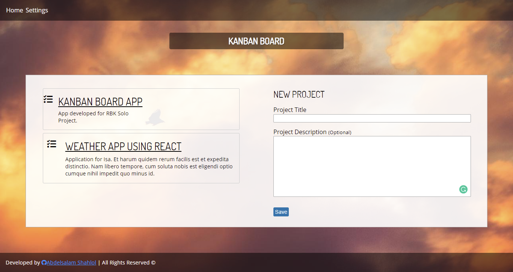
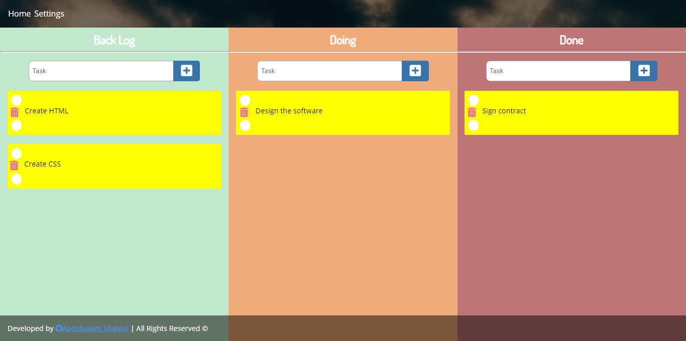

# Kanban Board 

### Developed Using
 - jQuery
 - History API
 - CSS 3
 - jQuery UI
 - HTML
 
 
```javascript
/*
	Project: Kanban Board
	Developed by: Abdelsalam Shahlol
	Date: 10 Nov 2019
	
	=== Expected Results ===
	Single page application.
	Muliple pages with router.
	100% beat the challange and meet the purpose.

	=== Build Rules ===
	Only use HTML, CSS3, jQuery, and JavaScript ES5.
	Only 48 hours to develop.
	Not allowed to ask other developers to contribute.
*/
```

## Screenshots



